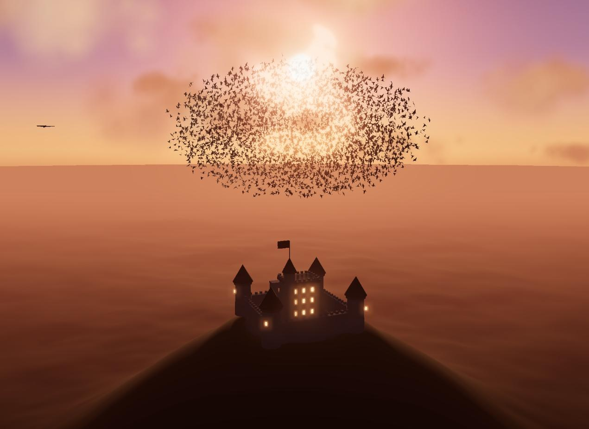

# Murmuration

A WebGL scene: a murmuration of thousands of starlings wheeling over a hilltop castle
at sunset. One self-contained HTML file, no build step.

**[See it running →](https://cmillsap.github.io/Murmuration/)**



Built with three.js r160.

## Running it

It's live at [cmillsap.github.io/Murmuration](https://cmillsap.github.io/Murmuration/).

To run it locally, double-click `index.html`. It pulls three.js from a CDN, so it
needs an internet connection but nothing else.

If your browser refuses the module import over `file://`, serve the folder instead:

```sh
python -m http.server 8765
# then open http://localhost:8765/index.html
```

## Controls

| | |
|---|---|
| drag | take over the camera (auto-orbit resumes after 4s idle) |
| scroll | zoom |
| `H` | show the control panel — flock size, flocking weights, orbit speed, falcon, bloom |
| `B` | swap the castle for a church |
| `P` | pause the simulation |

## How the flock works

Every bird's position and velocity lives in a floating-point texture. Each frame two
hand-written fragment shaders ping-pong those textures through a compute pass — one
integrates the flocking forces into velocity, the other advances position — and the
birds are drawn in a single instanced draw call whose vertex shader reads the state
back out, builds an orientation basis from each bird's velocity, banks it into its
turns and flaps its wings. Nothing about the flock ever touches the CPU.

The forces are the classic three, plus the things that make a murmuration look like a
murmuration rather than a swarm:

- **separation, alignment, cohesion**, with a rear blind arc — birds ignore neighbours
  behind them, which is how turns propagate as visible waves
- a **turn-rate limit** and min/max speed, so heading changes are arcs and no bird ever
  stalls
- a **roost lure** that wanders above the hilltop, weighted to squash the flock into the
  wide, shallow sheet real starlings form rather than a ball
- a **falcon** that sweeps through the flock and tears expanding holes in it
- a **flow field** that breaks the even grain into lobes and filaments
- a dome-shaped **floor** that lifts over the hill, so birds dip low over the plain but
  never clip the building

Neighbour search is the interesting constraint. A full O(N²) loop at 4,096 birds is
~33M texture fetches per frame, which will not hold 60fps. Instead each bird walks a
strided ring through the population, sampling 1,024 of its neighbours per frame. The
stride is chosen coprime with the population size so the walk covers everyone, and its
starting point rotates every frame — so over a handful of frames each bird has
effectively seen the whole flock. Accumulated forces are scaled by
`population / samples` to stay unbiased. Sampling a fixed number of partners rather
than everything inside a fixed radius also happens to sit closer to how starlings
actually behave, which is topological rather than metric.

Default is 4,096 birds; the panel goes to 16,384.

## The rest of the scene

Procedurally generated throughout — no external assets, no textures on disk. The hill
is a radially-graded polar mesh, dense at the summit and reaching the horizon in one
seamless surface. The castle and church are built from primitives. The sky is a
custom scattering shader driven by a single sun direction that also drives the light,
the cloud shading and the bird shading. Clouds are ~1,500 instanced billboards with a
cheap fake single-scatter that gives them a sunset rim, over a procedural puff texture
generated into a canvas at load. ACES tone mapping, and bloom on the sun.
